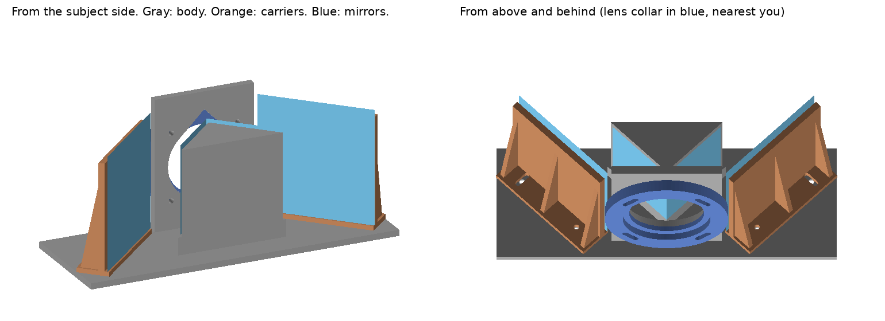

# Mirror overlay rig

A 3D printed, four-mirror attachment for a 50mm camera lens. It blends two views of a scene, seen from slightly different angles, into one image in the camera, without any editing afterward.



*Left: the assembled rig seen from the subject side. Right: seen from above and behind, with the lens collar nearest the viewer. Gray is the body, orange the mirror holders, blue the mirrors.*

## How it works

Seen from above, a 90 degree V of two small mirrors sits right in front of the lens, with its point toward the lens. Two larger mirrors sit farther out to the left and right.

- Light from the subject hits each outer mirror, goes sideways to the V, and then into the lens.
- The V is too close to the lens to be in focus, so it splits the lens opening, not the picture. The left half of the lens sees the scene through the left outer mirror, and the right half through the right one.
- The camera blends the two views. Whatever sits where the two views cross lines up as one image. Everything in front of or behind that point appears doubled and see-through.
- Each path bounces off two mirrors, so the image is not flipped.

## Status

Prototype v1. It has not been test printed or tested on a camera yet.

## Parts to print

All files are in the [`stl`](stl) folder.

| File | Part | Size (mm) |
|---|---|---|
| `1_body.stl` | Floor, back plate, and V block | 204 x 74 x 90 |
| `2_outer_mirror_carrier_RIGHT.stl` | Right outer mirror holder | 74 x 21 x 73 |
| `3_outer_mirror_carrier_LEFT.stl` | Left outer mirror holder | 74 x 21 x 73 |
| `4_lens_collar.stl` | Collar that holds the metal filter frame | 74 x 74 x 7 |

**Print settings**
- Print each part flat, as it opens in the slicer. No supports are needed.
- Matte black PLA, 0.2 mm layers, 3 walls, 15 to 20% infill.
- The body needs a print bed at least 210 mm wide.
- Print the lens collar first to check the fit before printing the body.

## What to buy

- Front-surface mirrors (also called first-surface mirrors), about 2 mm thick:
  - 2 at 58 x 46 mm for the V
  - 2 at 75 x 75 mm for the outer positions
- One 49mm UV filter. Remove the glass and keep the empty metal frame.
- M3 hardware:
  - 4 bolts, 10 mm long (mirror holders)
  - 4 bolts, 16 mm long (lens collar)
  - 12 nuts
- Thin double-sided tape for mounting the mirrors.

Regular household mirrors have the reflective coating behind the glass and create a faint double image. Use front-surface mirrors, and handle them by the edges, because the coating is exposed.

## Assembly

1. Glue the empty filter frame into the pocket on the back of the collar. Bolt the collar to the back plate. The curved slots let you rotate it until the rig sits level.
2. Tape the two small mirrors onto the angled faces of the V block, shiny side out. Rest them on the ledge at the bottom, and butt their edges together at the point.
3. Tape the large mirrors onto the holders, shiny side facing the V, resting on the holder base.
4. Bolt each holder to the floor with one bolt in the round hole (the pivot) and one in the curved slot (the clamp). The nuts go in the hex pockets under the floor.
5. Screw the filter frame onto the lens.

## Aiming and shooting

- To make both views meet on your subject, loosen a holder's clamp bolt, turn the holder slightly, and tighten it. The range is plus or minus 4.5 degrees per holder, which moves each view about plus or minus 9 degrees.
- Shoot wide open (f/1.8 or wider). Stopping down makes the edge at the point of the V show as a line.
- Each view gets about half the light, so expose about 1 stop brighter than normal.

## Mounting notes

The rig attaches to the lens, not the camera body. It screws into the lens filter threads through the metal filter frame.

- The rig with its mirrors weighs about 250 g, all of it on the filter threads. Support the front of the rig by hand when shooting.
- If the front of your lens turns or slides when focusing, use manual focus and set it before attaching the rig.

## Design assumptions

- Lens: 49mm filter thread (sized for the Sony FE 50mm f/1.8).
- Lens center: 44.5 mm above the bottom of the floor.
- Outer mirror centers: 62 mm left and right of the lens center, 26 mm in front of the back plate.

## Known limits

- Each view fades out toward one side of the frame, so the far left and right edges show mostly one view.
- There is no light shield. Stray light can cause flare. Draping black cloth over the top helps.

## Changing the design

The STL files are generated by [`src/build.py`](src/build.py). The sizes are listed in the `PARAMETERS` section at the top of the file. To change a size, such as the filter frame pocket (`SEAT_D`) or the mirror sizes, edit the number and run:

```
pip install manifold3d trimesh numpy pillow
python src/build.py
python src/render_preview.py
```

`build.py` rewrites the files in `stl/`, and `render_preview.py` redraws `images/preview.png`.
